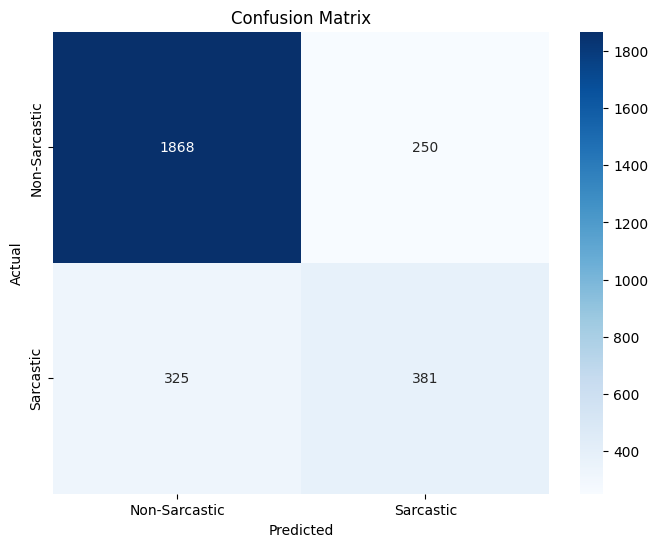

# Sarcasm Detection on Indonesian Reddit

Proyek ini bertujuan untuk membangun model *Natural Language Processing* (NLP) yang mampu mendeteksi kalimat sarkasme dalam bahasa Indonesia. Model ini dilatih menggunakan dataset komentar Reddit Indonesia dan di-*fine-tune* menggunakan arsitektur **DistilBERT**.

## Ringkasan Proyek
Sarkasme sering kali sulit dideteksi karena sangat bergantung pada konteks dan gaya bahasa. Dalam proyek ini, saya mengimplementasikan alur kerja NLP *end-to-end* mulai dari *preprocessing* teks gaul, tokenisasi, *training* model *Transformer*, hingga evaluasi performa model.

## Teknologi & Library
*   **Model Inti:** `cahya/distilbert-base-indonesian` (Hugging Face)
*   **Library:** PyTorch, Transformers, Datasets, Pandas, Scikit-learn
*   **Visualisasi:** Matplotlib, Seaborn
*   **Environment:** Google Colab (GPU)

## Dataset & Preprocessing
*   **Sumber Data:** `w11wo/reddit_indonesia_sarcastic` (via Hugging Face Datasets).
*   **Pembersihan Teks:**
    *   Mengonversi teks HTML ke *string* normal (`html.unescape`).
    *   Menerjemahkan kata gaul/singkatan ke bahasa baku (misal: *yg* -> *yang*, *bkn* -> *bukan*).
    *   Menghapus karakter berulang (misal: *hahaha*).
    *   Mengubah angka 2 pada kata ulang menjadi format *dash* (misal: *buku2* -> *buku-buku*).
*   **Tokenisasi:** Menggunakan `AutoTokenizer` dengan parameter `padding="max_length"`, `truncation=True`, dan `max_length=128`.

## Konfigurasi Training
*   **Epochs:** 3
*   **Batch Size:** 8 (dengan `gradient_accumulation_steps=4`)
*   **Precision:** FP16 (Mixed Precision untuk mempercepat komputasi di GPU)

## Hasil Evaluasi
Setelah proses *blind training*, model dievaluasi pada data *test* (sebanyak 2.824 data) dan menghasilkan performa berikut:

*   **Akurasi Keseluruhan:** **79.64%**
*   **Macro F1-Score:** **71.83%**

### Classification Report
| Class | Precision | Recall | F1-Score | Support |
| :--- | :---: | :---: | :---: | :---: |
| **Non-Sarcastic** | 0.85 | 0.88 | 0.87 | 2118 |
| **Sarcastic** | 0.60 | 0.54 | 0.57 | 706 |
| **Accuracy** | | | **0.80** | 2824 |

### Confusion Matrix
Visualisasi di bawah ini menunjukkan distribusi tebakan benar dan salah dari model:

*Insight:* Model sangat baik dalam mendeteksi kalimat non-sarkastik (1868 diprediksi benar). Namun, karena sifat data yang mungkin *imbalanced* atau kompleksitas sarkasme itu sendiri, masih terdapat *False Negatives* (325 data sarkas diangkap non-sarkas) dan *False Positives* (250 data non-sarkas dianggap sarkas).